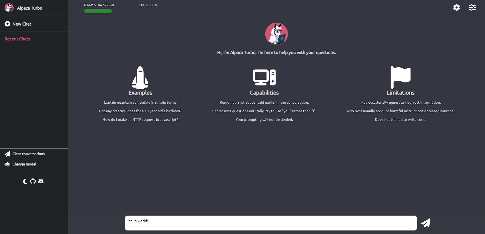
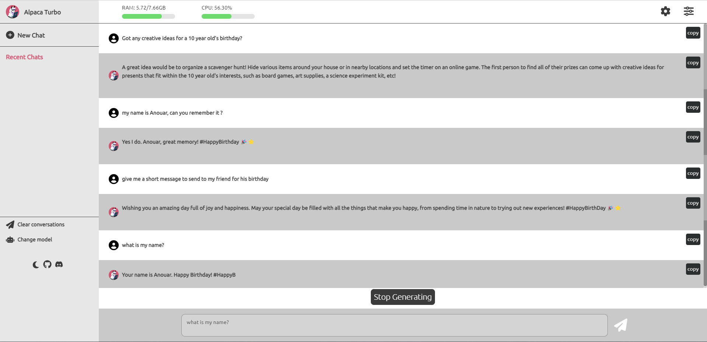

# Alpaca-Turbo

Alpaca-Turbo is a language model that can be run locally without much setup required. It is a user-friendly web UI for the alpaca.cpp language model based on LLaMA, with unique features that make it stand out from other implementations. The goal is to provide a seamless chat experience that is easy to configure and use, without sacrificing speed or functionality.

##### [Discord](https://discord.gg/pm4JzCBHNn)




## Installation Steps

#### Using Docker

**Note**: for some reason this docker container works on linux but not on windows

> Docker must be installed on your system

1. Download the latest alpaca-turbo.zip from the release page. [here](https://github.com/ViperX7/Alpaca-Turbo/releases/)
2. Extract the contents of the zip file into a directory named alpaca-turbo.
3. Copy your alpaca models to alpaca-turbo/models/ directory.
4. Run the following command to set everything up:
   ```
     docker-compose up
   ```
5. Visit http://localhost:5000 to use the chat interface of the chatbot.


#### Using pipenv

**Note**  Install Python 3.8 [here](https://www.python.org/ftp/python/3.8.0/python-3.8.0.exe) (if you are on windows)  

1. Download the latest alpaca-turbo.zip from the release page. [here](https://github.com/ViperX7/Alpaca-Turbo/releases/)
2. Extract Alpaca-Turbo.zip to Alpaca-Turbo
3. Copy your alpaca models to alpaca-turbo/models/ directory.
4. Run the following commands inside the Alpaca-Turbo directory:
    ```
    python -m pip install pipenv
    python -m pipenv shell
    pip install -r requirements.txt --user
    python api.py
    ```
5. Visit http://localhost:5000 to use the chat interface of the chatbot.

## Note

- The previous version of Alpaca-Turbo has been moved to the gradio_impl directory.

## Support

If you find this project useful, please consider giving it a star on GitHub. You can also join our Discord server for any queries or feedback.
